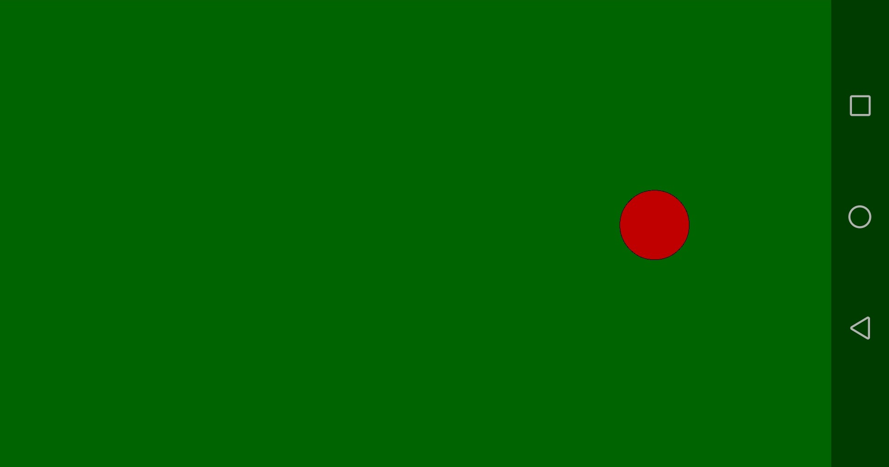

# RollingBall
Android application simulating a rolling ball using sensors

## Table of contents
* [General info](#general-info)
* [Screenshots](#screenshots)
* [Technologies](#technologies)
* [Setup](#setup)
* [Features](#features)

## General info
Project made for the subject Applications for Mobile Devices on the Universitat de Valencia during my Erasmus+ exchange. The project was made to get familiar with prototyping mobile applications using Processing.

## Screenshots

## Technologies
* Processing - version 3.5.4
* Ketai

## Setup
The program can be run on Processing suing Java mode.

## Features
* moving the ball rotating a mobile phone

The ball acts as if it was on the screen of the mobile phone and for example when the user rotates a mobile phone to the left the ball also moves to the left. It works like a ramp.

